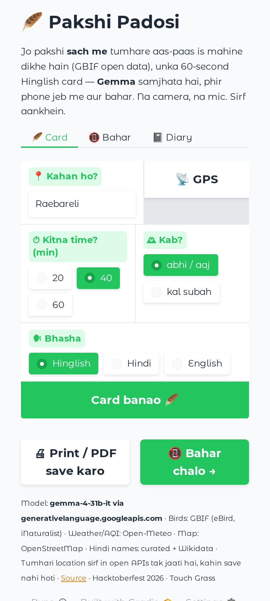
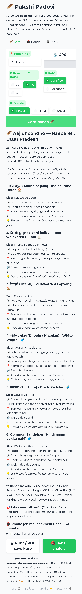
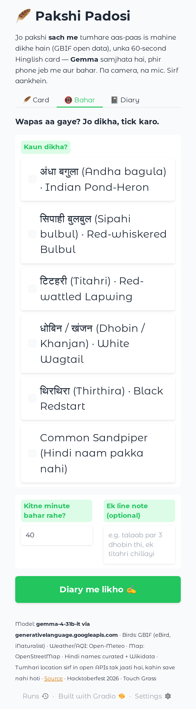

# 🪶 Pakshi Padosi — पक्षी पड़ोसी

**The birds actually recorded near you this month, by name, in Hinglish — a 60-second card, then you put the phone away and go look.**

Built for [Hacktoberfest 2026 · Week 1: Touch Grass](https://dev.to/challenges/hacktoberfest-week1-2026-10-05). Started and finished inside the challenge window (6–11 Oct 2026).

Live: **https://pakshi-padosi.onrender.com** *(free Render instance — give it ~40 s to wake up)*

## What it does

1. **Kahan ho?** — GPS or a town name. (Default: Raebareli, Uttar Pradesh, where I live.)
2. **Open data decides which birds.** The app asks [GBIF](https://www.gbif.org) (eBird + iNaturalist records, no key) which species people have recorded around you in this month ±1, widening the radius 25 → 50 → 100 km until there's enough data — and tells you the radius and the count. A four-season signature spots the **winter mehmaan** (migrants seen Oct–Feb but not in the monsoon) versus the **padosi** (residents).
3. **Open data decides when.** [Open-Meteo](https://open-meteo.com) gives sunrise/sunset, rain probability and AQI; the app picks the best 20/40/60-minute window (first hour after sunrise, dry, not smoggy).
4. **Gemma explains — nothing more.** Six birds (3 easy neighbours + 3 seasonal visitors) described **by eye**: size vs gauraiya/maina/kauwa, two field marks, where to look, one sound cue, one memory hook. The species list is *input* to the model; it cannot add a bird or invent a Hindi name (the app validates and overrides).
5. **📵 Bahar chalo.** Print the card or screenshot it. Phone in pocket.
6. **Wapas aake tick karo.** Tick what you saw; Gemma writes three Hinglish diary lines and tomorrow's one-bird challenge. Export the diary as Markdown or as an **eBird CSV** — your walk becomes open data for the next person.

Hindi names come from a hand-curated list of folk names used in the Gangetic plain, with Wikidata filling gaps (Wikidata's Hindi labels for birds are often transliterations — "हूपू" for हुदहुद — so curated wins). When neither knows, the card says **"Hindi naam pakka nahi"** instead of guessing.

## Screenshots

| Home | Card (Raebareli, Oct 2026) | Bahar — tick what you saw |
|---|---|---|
|  |  |  |

Taken on the live Render deployment with `scripts/take_screenshots.py` (Playwright, 412×915).

## Why open?

- **The list is cited, not hallucinated.** Every bird on the card exists because real people recorded it near you. A closed chat API would have confidently produced a plausible list.
- **Hindi birding has no field guide.** Open weights handle Hinglish well enough that "safed chehra, kaali chhaati, poonchh hilati rehti hai, paani ke kinare" finds you a White Wagtail.
- **₹0, no account, nothing stored.** Your coordinates go into two public read-only queries. The diary lives in your browser (`localStorage`), nowhere else.
- **Degrades to paper.** The screen is the shortest part — by design, and by necessity (Samaspur Bird Sanctuary has no signal).
- **Swappable brain.** `LLM_BASE_URL=http://localhost:11434/v1 LLM_MODEL=gemma3:4b` → same app on a laptop with Ollama.
- **The data flows back.** eBird CSV export closes the loop: open model + open data + open contribution.

## Run it

```bash
git clone https://github.com/Yuser00123/pakshi-padosi && cd pakshi-padosi
python -m venv .venv && source .venv/bin/activate      # Windows: .venv\Scripts\activate
pip install -r requirements.txt
cp .env.example .env                                   # add LLM_API_KEY (free: aistudio.google.com) — or leave empty for mock mode
python app.py                                          # → http://localhost:7860
```

`python test_app.py` runs the offline tests (recorded GBIF/Open-Meteo fixtures; no key, no network).

### Deploy on Render (free)

New → Blueprint → this repo (`render.yaml` sets everything, region Singapore, health check `/health`). Add `LLM_API_KEY` in the dashboard. Optional: `TOWN_DEFAULT=YourTown`.

### Environment

| Variable | Default | Notes |
|---|---|---|
| `LLM_PROVIDER` | `openai` | `openai` (any OpenAI-compatible endpoint), `google` (google-genai SDK), `mock` |
| `LLM_API_KEY` | — | Google AI Studio key (free tier) or any provider's key |
| `LLM_BASE_URL` | Gemini OpenAI-compat URL | e.g. `http://localhost:11434/v1` for Ollama |
| `LLM_MODEL` | `gemma-4-31b-it` | tested; `gemma-4-26b-a4b-it` is faster; `gemma3:4b` on Ollama |
| `LLM_MAX_TOKENS` | `6000` | Gemma 4 thinks before it answers; thinking eats tokens |
| `TOWN_DEFAULT` | `Raebareli` | initial location box |
| `TOWN_COORDS` | — | its coordinates (`26.2087, 81.2186`), so the default needs no geocoder |
| `GBIF_ENOUGH_RECORDS` | `1000` | widen the radius until this many seasonal records |
| `CARD_BUDGET_S` / `BIRD_BUDGET_S` | `90` / `70` | show the card with whatever Gemma finished by then / no new retry per bird after this |

## How it's built

```
app.py        Gradio 6 on FastAPI (+ GET /health), PWA; three tabs: Card · Bahar (field checklist) · Diary; BrowserState persistence
birds.py      GBIF client: adaptive radius, effort-corrected four-season migrant classifier, hotspot clustering from coordinates
sky.py        Open-Meteo: sunrise/sunset/rain/AQI → best window (NOAA sunrise maths as fallback); responses cached 1 h
places.py     geocoding: OSM Nominatim → Photon → built-in Indian city table (free hosts share IPs that get refused)
names.py      Hindi names: curated folk names → Wikidata → "pakka nahi"
prompts.py    one-bird prompt (strict JSON, our species + status as input) + diary prompt + deterministic mock
data/desc_seed.json   Gemma's own descriptions for the demo town, shipped so the default card is instant (see below)
llm.py        provider-agnostic client (OpenAI-compatible / google-genai / mock) with Gemma-4 thought stripping + retries
scripts/build_hindi_names.py   one-shot Wikidata SPARQL → data/hindi_names.json
test_app.py   offline tests with fixtures in tests/fixtures/
```

**Gemma 4 note.** Through the Gemini OpenAI-compatible endpoint Gemma 4 returns its reasoning inline as `<thought>…</thought>` and takes 20–60 s per answer. The first version asked for the whole six-bird card in one call: **194 s** on the live server, and a single 500 lost everything. Now each bird is its own small call, six run in parallel, and the page fills in as they finish (first bird ≈ 35 s); a bird that still fails after its retry budget is shown with name + status from the data and a one-line "press again" note — the finished ones are cached, so the second press only writes the missing ones. The header lines (opening, where-to-go, hardest bird) are plain templates filled from the data, not model output: nothing to hallucinate there.

**Seed cache.** `data/desc_seed.json` holds the descriptions Gemma wrote for Raebareli's six birds during the first live runs, so the demo town's card appears instantly and survives the API's bad hours. Everything else is generated live; `GET /cache` dumps what the running instance has written if you want to grow the seed.

**Migrant classifier.** A species' records are split by season and compared with *all* bird records in the same circle (= when people actually go birding). A resident keeps a fair share in every season; a winter visitor vanishes in the monsoon. Without the effort correction, a sanctuary that birders visit mostly in winter made every resident look like a winter visitor (Bharatpur: 25 "visitors" → 1). Small samples need a clean zero in the off-season; under 15 records we just say resident.

## Credits

- Bird records: [GBIF](https://www.gbif.org) — chiefly the [eBird Observation Dataset](https://www.gbif.org/dataset/4fa7b334-ce0d-4e88-aaae-2e0c138d049e) and [iNaturalist Research-grade Observations](https://www.gbif.org/dataset/50c9509d-22c7-4a22-a47d-8c48425ef4a7), i.e. thousands of birders who logged what they saw. Thank you.
- Weather & air quality: [Open-Meteo](https://open-meteo.com) (CC BY 4.0). Geocoding: [OpenStreetMap](https://www.openstreetmap.org/copyright) contributors. Hindi names: Wikidata (CC0) + my own curation.
- Model: [Gemma 4](https://ai.google.dev/gemma) (Apache-2.0) via Google AI Studio's free tier.
- `llm.py` is reused from my previous-weekend project [Samjhao](https://github.com/Yuser00123/samjhao) (my own code, MIT).

MIT © 2026 Yuser00123
